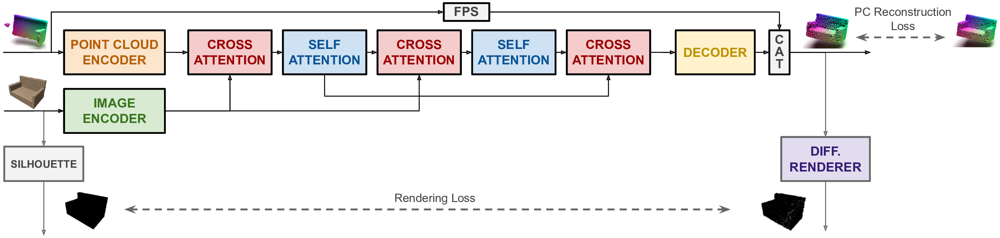
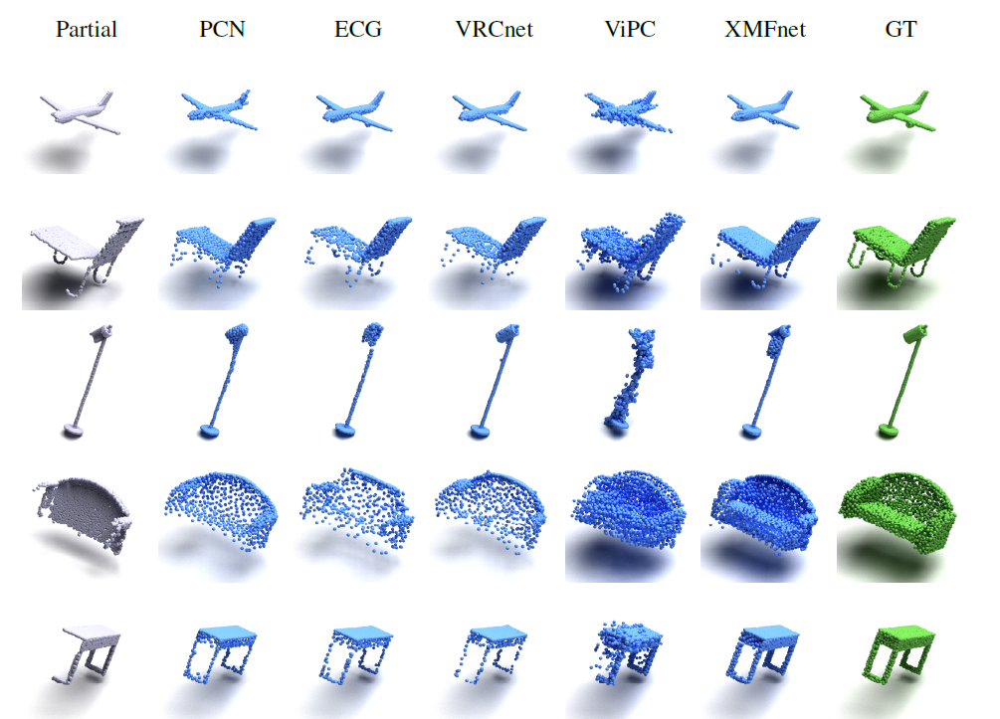

[](https://paperswithcode.com/sota/point-cloud-completion-on-shapenet-vipc?p=cross-modal-learning-for-image-guided-point)

[](https://arxiv.org/abs/2209.09552)


# XMFnet : Cross-Modal Learning for Image-Guided Point Cloud Shape Completion
This repository contains the official implementation for "Cross-modal Learning for Image-Guided Point Cloud Shape Completion" (NeurIPS 2022) [paper](https://arxiv.org/pdf/2209.09552.pdf)



## Introduction
In this paper we explore the recent topic of point cloud completion, guided by an auxiliary image. We show how it is possible to effectively combine the information from the two modalities in a localized latent space, thus avoiding the need for complex point cloud reconstruction methods from single views used by the state-of-the-art. We also investigate a novel weakly-supervised setting where the auxiliary image provides a supervisory signal to the training process by using a differentiable renderer on the completed point cloud to measure fidelity in the image space. Experiments show significant improvements over state-of-the-art supervised methods for both unimodal and multimodal completion. We also show the effectiveness of the weakly-supervised approach which outperforms a number of supervised methods and is competitive with the latest supervised models only exploiting point cloud information.

## Requirements
The code has been developed with the following dependecies:

- Python 3.8 
- CUDA version 10.2
- G++ or GCC 7.5.0
- Pytorch 1.10.2

To setup the environment and install all the required packages run:

```setup
sh setup.sh
```

It automatically creates the environment and install all the required packages.

If something goes wrong please consider to follow the steps in setup manually.


## Dataset 

The dataset is borrowed from ["View-guided point cloud completion"](https://github.com/Hydrogenion/ViPC).

First, please download the ShapeNetViPC-Dataset ([Dropbox](https://www.dropbox.com/s/271igg35ti93y6z/ShapeNetViPC-Dataset.tar.gz?dl=0), [Baidu](https://pan.baidu.com/s/1NJKPiOsfRsDfYDU_5MH28A)) (143GB, code: **ar8l**). Then run ``cat ShapeNetViPC-Dataset.tar.gz* | tar zx``, you will get ``ShapeNetViPC-Dataset`` contains three floders: ``ShapeNetViPC-Partial``, ``ShapeNetViPC-GT`` and ``ShapeNetViPC-View``. 

For each object, the dataset include partial point cloud (``ShapeNetViPC-Patial``), complete point cloud (``ShapeNetViPC-GT``) and corresponding images (``ShapeNetViPC-View``) from 24 different views. You can find the detail of 24 cameras view in ``/ShapeNetViPC-View/category/object_name/rendering/rendering_metadata.txt``.

In the "dataset" folder of this project you can find the train and test list, that are the same as the original one, except for the formatting style.

Further partialized inputs used for the weakly supervised setting are also available for download ([Dropbox](https://www.dropbox.com/s/5njn6ptkt42sqr9/ShapeNetViPC-PartPart.tar.gz?dl=0))

## Training
The file config.py contains the configuration for all the training parameters.

To train the models in the paper, run this command:

```train
python train.py 
```


## Evaluation

To evaluate the models (select the specific category in config.py):

```eval
python eval.py 
```


## Pre-trained Models

You can download pretrained models here:

[Supervised checkpoints](https://www.dropbox.com/s/zskedwfq32i14aq/checkpoints_supervised.zip?dl=0)

[Weakly supervised checkpoints](https://www.dropbox.com/s/ht9cg3zzz941i5t/checkpoints_weakly_supervised.zip?dl=0)


## Results

### [Point Cloud Completion on ShapeNet-ViPC](https://paperswithcode.com/sota/point-cloud-completion-on-shapenet-vipc)




## Acknowledgements
Some of the code is borrowed from [AXform](https://github.com/kaiyizhang/AXform). 

Visualizations have been created using [Mitsuba 2](https://www.mitsuba-renderer.org/).


## Citation
If you find our work useful in your research, please consider citing: 

```
@inproceedings{aiello2022cross,
 author = {Aiello, Emanuele and Valsesia, Diego and Magli, Enrico},
 booktitle = {Advances in Neural Information Processing Systems},
 title = {Cross-modal Learning for Image-Guided Point Cloud Shape Completion},
 year = {2022}
}
```


## License 
Our code is released under MIT License (see LICENSE file for details).


